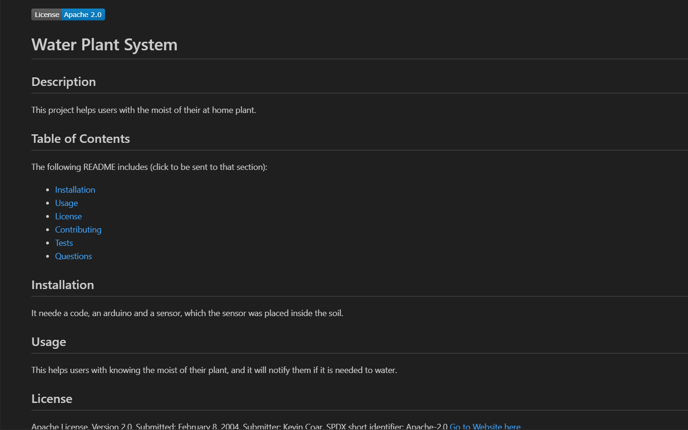

# My-Own-README-Creator
## Description
This is README generator that creates faster and easier README files with just the user's input as a prompt. 
There will be some questions displayed when the user writes in the terminal 'node index.js'. Go through all the questions 
after it will display a professional README file ready to use.

## Installation
I made a repository in GitHub, then copied the folder Develop and modified to complete the work.

## Usage
It will help me and the users create a faster READMEfile which will only take the input of what the user decides to display. The code will
automatically create the headings, links and information needed. 

## Credits
The University of Toronto,
Ariana Vinamagua